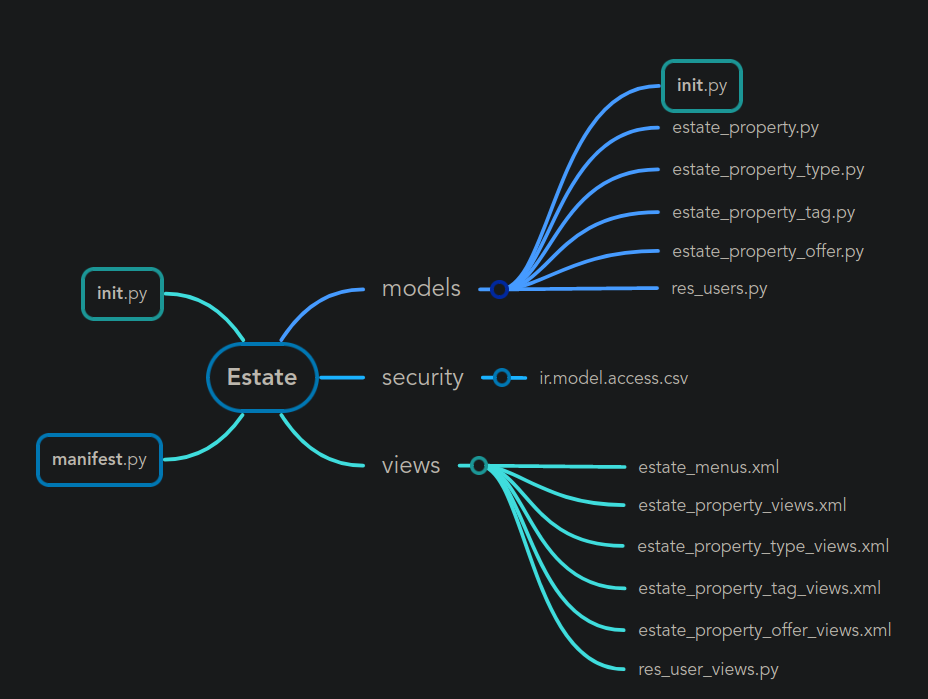
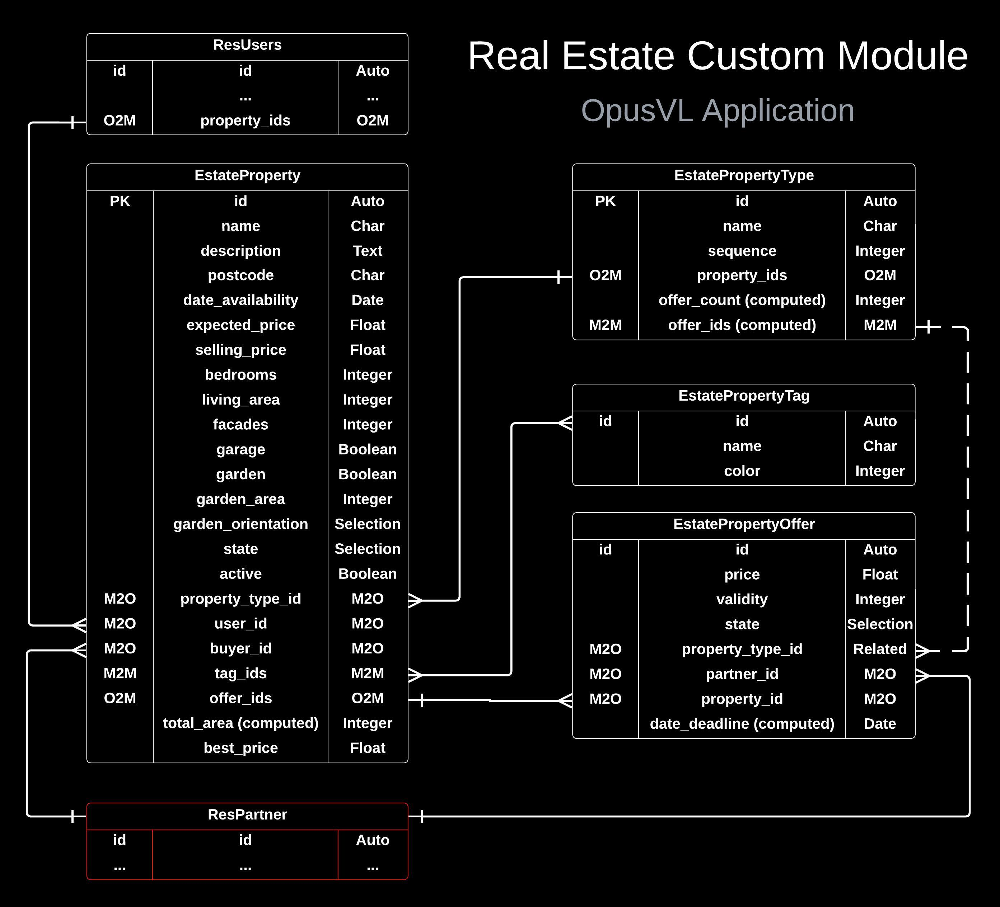
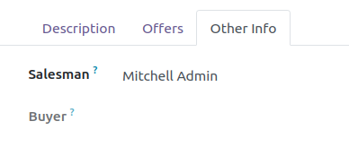
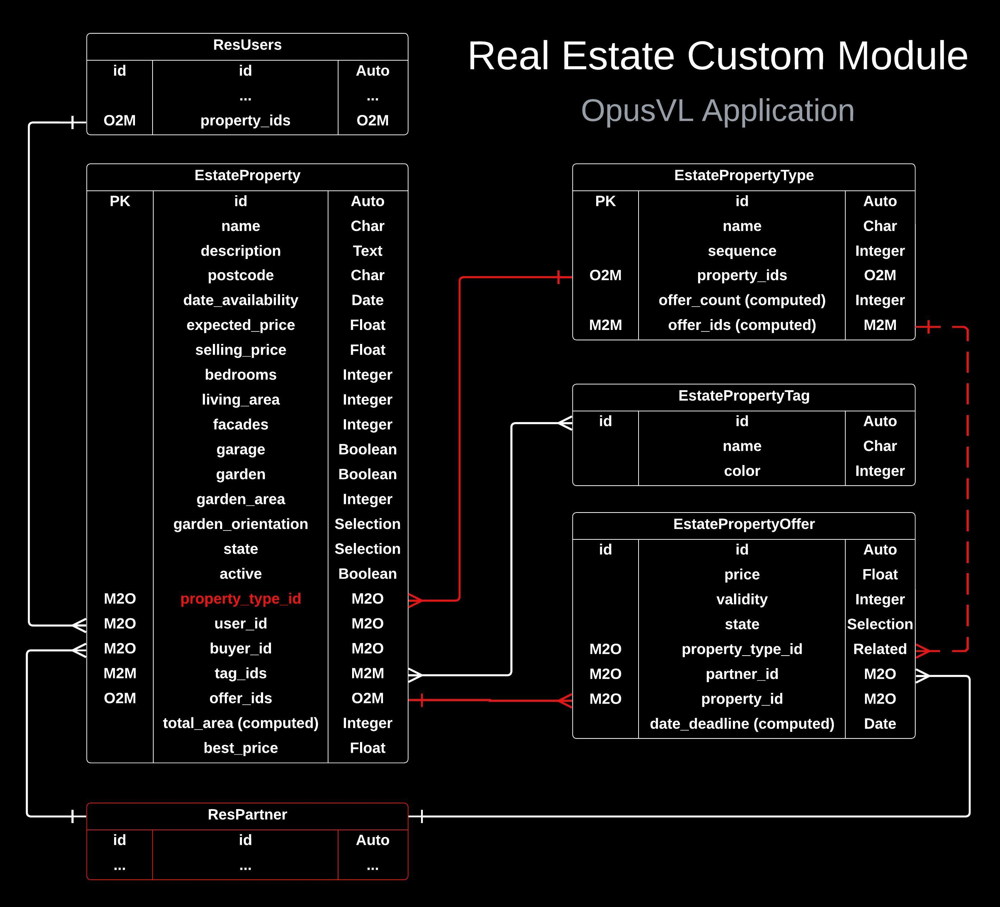

<div id="top"></div>

<div style="text-align:center"></div>

## 1. Introduction

### 1.1 Overview


<p align="center">
  
</p>


<p align="right">(<a href="#top">back to top</a>)</p>

## 2. Business Requirements

All of the requirements are coming from the Odoo: Tutorial series on the
website. 


<p align="right">(<a href="#top">back to top</a>)</p>

## 3. Design

### 3.1 Structure

Base structure for a MVP.

<p align="center">
  
</p>


### 3.2 Database

<p align="center">
  
</p>


### 3.3 Workflows

Here is a quick demonstration on how users can use the app: [video link](https://youtu.be/dchSIBy2p4s)


<p align="right">(<a href="#top">back to top</a>)</p>

## 4. Relationships

### 4.1 Estate Property Model:

### 4.1.1 Property - Property Type:

- 1 Property can have 1 Type
- 1 Type can have Many Properties

<ins>Relationship field in estate_property.py</ins>:

```bash
property_type_id = fields.Many2one("estate.property.type", string="Property Type")
```

<ins>Relationship field in estate_property_type.py</ins>:

```bash
property_ids = fields.One2many("estate.property", "property_type_id", string="Properties")
```

Simple FK relationship.


### 4.1.2 Property - Salesman:

- 1 Property can be assigned to 1 Salesman
- 1 Salesman can be assigned to Many Properties

<ins>Relationship field in estate_property.py</ins>:

```bash
user_id = fields.Many2one(
    "res.users", string="Salesman", default=lambda self: self.env.user
)
```

<ins>Relationship field in res_users.py</ins>:

```bash
property_ids = fields.One2many(
    "estate.property", "user_id", string="Properties", domain=[("state", "in", ["new", "offer_received"])]
)
```

For the default field, the lambda function returns the current user
(self.env.user). In this case, Mitchell Admin was signed in.

<p align="center">
  
</p>

The domain helps us filter the EstateProperty records. We only want "new" and
"offer_received" records. Why? When we access a salesman, we will only see their
works that are in progress, and not all of the work they have done. This will
pile up over time, so its good to keep it minimal.

<ins>Why "res.users"?</ins>

This model is used to store information about the users of the system. The model
is responsible for managing user authentication, access rights, and user
preferences.

### 4.1.3 Property - Buyer:

- 1 Property can be assigned to 1 Buyer
- 1 Buyer can be assigned to Many Properties

<ins>Relationship field in estate_property.py</ins>:

```bash
buyer_id = fields.Many2one("res.partner", string="Buyer", readonly=True, copy=False)
```

- readonly: We only want this to be set in the offers tab.
- copy: if record is copied, this field will stay Null.

The res.partner model is used as-is without any additional fields or
customizations specific to this implementation.

### 4.1.4 Property - Tag:

- Many Properties can be assigned to Many Tags & vica versa.

<ins>Relationship field in estate_property.py</ins>:

```bash
tag_ids = fields.Many2many("estate.property.tag", string="Tags")
```

### 4.1.5 Property - Offers:

- 1 Property can be assigned to 1 Offer
- Many Offers can be assigned to 1 Property


<ins>Relationship field in estate_property.py</ins>:

```bash
offer_ids = fields.One2many("estate.property.offer", "property_id", string="Offers")
```

<ins>Relationship field in estate_property_offer.py</ins>:

```bash
property_id = fields.Many2one("estate.property", string="Property", required=True)
```

`required=True` since we shouldn't create an offer without assigning it to a property.


### 4.1.6 Offer - Partner:

- Many offers can be assigned to 1 Buyer
- One Buyer can be assigned to 1 Offer

<ins>Relationship field in estate_property_offer.py</ins>:

```bash
partner_id = fields.Many2one("res.partner", string="Buyer", required=True)
```

### 4.1.7 Property Type - Offers:

- Many Offers can be related to 1 Property Type (through their associated Property)
- 1 Property Type can be related Many Offers.

<p align="center">
  
</p>

<ins>Relationship field in estate_property_offer.py</ins>:

```bash
    property_type_id = fields.Many2one(
        "estate.property.type",
        related="property_id.property_type_id",
        string="Property Type",
        store=True,
    )
```

It is a related field that connects the estate.property.offer model to the
estate.property.type model through the property_id field, which in turn links to
the estate.property model.

The related="property_id.property_type_id" argument specifies that the
property_type_id field in the estate.property.offer model should get its value
from the property_type_id field of the related estate.property record.


<ins>Relationship field in estate_property_type.py</ins>:

```bash
offer_ids = fields.Many2many("estate.property.offer", string="Offers", compute="_compute_offer")
```

In Odoo 16 (might be the case for all versions), the related fields do not get
stored, storing this field will aid in searching/sorting/fitlering records based
on the related field's value. We could use join in our SQL queries to do this as
well, but this is more efficient also, it will improve the performance.

Basically, we are storing `type` info in the `offer` model.


<p align="right">(<a href="#top">back to top</a>)</p>

## 5. Compute Methods & Fields

This section explains the complex compute methods to bring clarity to how they
are made and why they are made.

### 5.1 _compute_offer in estate_property_type:

Calculates the total number of offers and the specific offer ids for each
property type.

Why do we need this? We don't want to get all offer_ids inside the
estate_property_type model. We don't want any offers that are associated to a
property that is cancelled AND we don't want offers that are associated to a
property that has a property type id that is empty (False).

#### 5.1.1 data:

The data variable is the aggregate data, with conditions:

- Property state is not "cancelled"
- Property_type_id not empty.

Then group by the data by `property_type_id`.

Use the `array_agg` function to count the offer_ids for each property type.

The result of data looks like something like this:

```python
[
    {
        'property_type_id': (1, 'Type A'),
        'property_type_id_count': 3,
        'ids': [1, 2, 3]
    },
    {
        'property_type_id': (2, 'Type B'),
        'property_type_id_count': 2,
        'ids': [4, 5]
    },
    {
        'property_type_id': (3, 'Type C'),
        'property_type_id_count': 1,
        'ids': [6]
    },
]

```

So:

- property_type: 1 has 3 offers with ids 1, 2, 3
- property_type 2 has 2 offers with ids 4, 5
- property_type 3 has 1 offer with id 6


#### 5.1.2 mappings:

Create 2 mappings to store the number of offers and offer ids for each property
type (make the property_id the key).

1. mapped_count: store count of offers for each prop_type. Example of what it
   will look like:

```python
{
    1: 3,  # Property type 1 has 3 offers
    2: 2,  # Property type 2 has 2 offers
    3: 1   # Property type 3 has 1 offer
}
```

2. mapped_ids: store a LIST of offer_ids.


```python
{
    1: [10, 11, 12],  # Property type 1 has offers with ids 10, 11, and 12
    2: [13, 14],      # Property type 2 has offers with ids 13 and 14
    3: [15]           # Property type 3 has an offer with id 15
}
```

#### 5.1.3 compute recordset:

Iterate over each property type and calculate its offer_count & offer_ids.

- offer_count: uses the mapped_count dict to count of offers. If type id is not
  in the dictionary, use 0.
- offer_ids: uses the mapped_ids dict to get offer_ids. If type id is not in the
  dictionary, use emtpy list.

Finally, we have offer_count and offer_id fields are updated with appropriate values.


## Scripts

After making a change in the local files, use the `update_odoo.sh` script to
automatically push the custom module files into the Docker container.

### To use, run:

```bash
update_odoo.sh <module_name> <file_name>
```

## Linting & Formatting

I got the pre-commit setup from OCA, it does not belong to me. Also I stole some
from your linting config files :) I also have a GitHub workflow added. 


## Running Tests:


```
docker-compose exec web /usr/bin/odoo -d rd-demo -u estate --test-enable --log-level=test --stop-after-init --db_host=db --db_port=5432 --db_user=odoo --db_password=odoo
```


Build Docker Container:

```docker-compose up --build -d```


Stop the container:

```docker-compose down```

